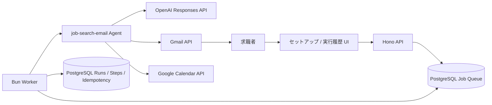
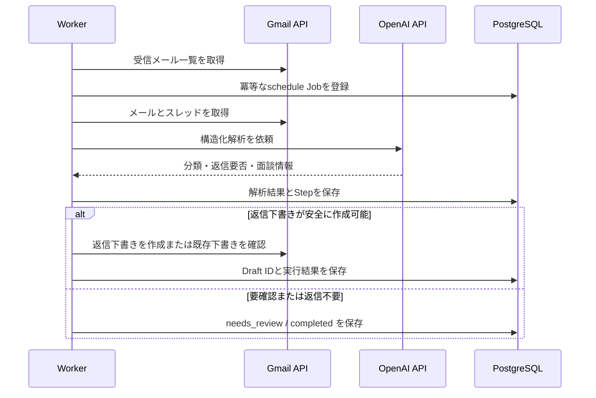

# AIAgents — 就職活動メールエージェント

Gmailで受信した就職活動・採用連絡メールを解析し、返信が必要なメールの**Gmail下書き**を作成するTypeScriptアプリケーションです。確定したオンライン面談は、設定に応じてGoogle Calendarへ登録します。メールの自動送信は行いません。

本リポジトリは、RAYVEN 技術課題のテーマA「AI APIを使ったAIエージェント開発」の成果物として整備しています。

## 解決する業務課題

就職活動中は、採用担当者からの面談調整・書類依頼・選考結果などが複数社から届きます。返信漏れや日程調整の遅れを防ぐために、受信メールを定期確認し、確認・編集して送れる状態の下書きまでを自動化します。

想定ユーザーは、複数社の選考を並行している求職者です。メールを送信する最終判断は常にユーザーが行います。

## 主な機能

- Gmail OAuthによる受信メールの取得とGmail下書き作成
- OpenAI Responses APIのStructured Outputsによるメール分類・返信要否・面談情報の抽出
- 日程調整メールに対する、候補日時を編集できる返信下書きの作成
- Google Calendarへの面談予定登録（明示的な安全条件を満たした場合のみ）
- PostgreSQLジョブキューによる定期実行、リトライ、冪等性制御
- セットアップ画面からの即時定期実行・既存ジョブの安全な再実行
- 実行履歴、対象メール件名、各Step、Gmail Draft IDの表示

## アーキテクチャ



### 処理フロー



## 技術選定

| 領域 | 採用技術 | 選定理由 |
|---|---|---|
| 言語・Runtime | TypeScript / Bun | 型安全な実装、テスト、Workspaceを1つの開発体験にまとめるため |
| API | Hono | OAuth callback、管理画面、実行履歴を小さく実装するため |
| AI API | OpenAI Responses API | Structured OutputsでLLMの出力形式を固定し、後続の安全判定を型安全に行うため |
| 永続化・キュー | PostgreSQL / postgres.js | 実行履歴、冪等性、`FOR UPDATE SKIP LOCKED`によるジョブ取得を一貫して扱うため |
| バリデーション | Zod | HTTP入力、LLM出力、外部API応答を実行時にも検証するため |
| Google連携 | Gmail API / Calendar API | 実務上のメール下書き・予定登録に直接つなげるため |

詳細は [技術スタック](docs/architecture/technical-stack.md)、[依存関係](docs/architecture/dependency-rules.md)、[エージェント運用ガイド](docs/agents/job-search-email-agent/operation-guide.md) を参照してください。

## 安全設計

- メールは**送信しません**。作成対象はGmail下書きだけです。
- LLM出力はZodで検証し、信頼度・必要情報・スレッドの鮮度を確認してから外部書き込みを行います。
- Gmail本文、Prompt、LLMの生成本文はDBや実行履歴へ保存・表示しません。
- 同一メールは冪等キーで重複処理を防ぎます。
- DBにある下書きIDを再利用する前にGmailの実在を確認し、存在しない場合は安全に再作成します。
- Google Refresh TokenはAES-256-GCMで暗号化して保存します。

## セットアップ

### 必要環境

- Bun 1.3.14
- Docker / Docker Compose
- Google CloudのOAuth Client（Gmail read / compose、必要に応じてCalendar）
- OpenAI API Key

### 1. 依存関係をインストール

```bash
bun --no-env-file install
```

### 2. 環境変数を設定

設定名と説明は [.env.example](.env.example) を参照してください。秘密値をGitへコミットしないでください。

最低限、次の値が必要です。

```bash
export GOOGLE_CLIENT_ID='...'
export GOOGLE_CLIENT_SECRET='...'
export TOKEN_ENCRYPTION_KEY="$(openssl rand -base64 32)"
export OPENAI_API_KEY='...'
export OPENAI_ANALYSIS_MODEL='gpt-5.6-luna'
export OPENAI_REPLY_MODEL='gpt-5.6-luna'
```

Google Cloud Consoleでは、`http://localhost:4000/auth/google/callback` をOAuthの承認済みリダイレクトURIとして登録します。共有・本番環境ではHTTPS URLを利用してください。

### 3. 起動

```bash
docker compose up --build
```

起動後、以下を開きます。

- セットアップ: <http://localhost:4000/setup>
- 実行履歴: <http://localhost:4000/history>
- ヘルスチェック: <http://localhost:4000/health/ready>

開発時のホットリロードは次を使います。

```bash
bun --no-env-file run compose:dev
```

## 使い方

1. セットアップ画面で「Gmail 読み取り」と「Gmail 下書き」の権限を登録します。
2. 「返信下書き設定」に氏名・署名・信頼度しきい値を保存し、下書き作成を有効にします。
3. 「今すぐ定期実行を実行」を押すか、Workerの定期実行を待ちます。
4. 実行履歴で対象メールの件名、分類、下書きID、要確認理由を確認します。
5. Gmailの「下書き」で内容を編集・確認してから、ユーザー自身が送信します。

定期実行は起動直後と、その後 `GMAIL_POLL_INTERVAL_SECONDS` ごとに動きます。既定値は300秒です。検索対象は `GMAIL_LOOKBACK_QUERY`（既定: `in:inbox newer_than:1d`）に一致するメールです。

同じメールを再解析したい場合は「既存ジョブをリセットして再実行」を使います。過去の実行履歴は削除せず、新しいJobを作成します。Gmail下書きとCalendar予定は重複作成しません。

## テスト

```bash
bun --no-env-file run typecheck
bun --no-env-file run lint
bun --no-env-file test
```

外部サービスを使う統合テストは、明示的に起動したローカルPostgreSQLに対して実行します。

```bash
bun --no-env-file run test:integration:database
bun --no-env-file run test:integration:docker
```

CIはGitHub Actionsで型チェック・Lint・テストを実行します。

## 設計上の意図と今後の拡張

LLMにはメールの意味理解と構造化抽出を任せ、下書き作成やCalendar登録の可否はTypeScriptのPolicyと検証済みデータで決定します。これにより、自然言語の柔軟性と外部操作の安全性を分離しています。

次の拡張を想定しています。

- 求人票・企業情報を参照するRAG
- ユーザーの空き時間を使った候補日時の提案
- 要確認メールの専用レビュー画面
- Push通知（Gmail Watch）と通知チャネル連携
- LLM評価データセットと回帰評価の継続運用

### 技術課題に対する補足

現状はOpenAI APIを直接呼び、構造化出力を使う業務エージェントです。一方で、課題文が中心要件として挙げる**LLM主導のFunction Calling / Tool Useループ**は未実装です。外部操作はLLMの任意ツール呼び出しではなく、検証済みの解析結果に基づくTypeScriptワークフローとして実行しています。

テーマAの要件を完全に満たす提出物とするには、ツール定義、モデルのtool call受信、引数検証、ツール実行、結果をモデルへ戻すループを追加する必要があります。実装済み範囲と提出前チェックは [提出ガイド](docs/submission.md) にまとめています。
