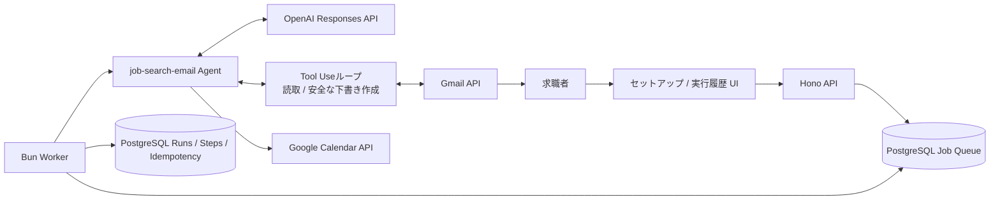
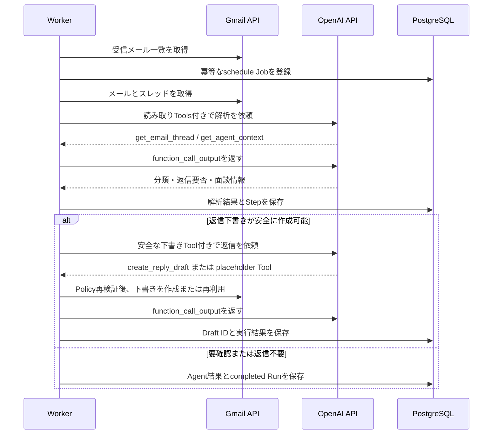

# AIAgents — 就職活動メールエージェント

Gmailで受信した就職活動・採用連絡メールを解析し、返信が必要なメールの**Gmail下書き**を作成するTypeScriptアプリケーションです。確定したオンライン面談をGoogle Calendarへ登録する処理も実装していますが、現行のセットアップ画面ではCalendar作成を有効化できません。メールの自動送信は行いません。

## 解決する業務課題

就職活動中は、採用担当者からの面談調整・書類依頼・選考結果などが複数社から届きます。返信漏れや日程調整の遅れを防ぐために、受信メールを定期確認し、確認・編集して送れる状態の下書きまでを自動化します。

想定ユーザーは、複数社の選考を並行している求職者です。メールを送信する最終判断は常にユーザーが行います。

## 主な機能

- Gmail OAuthによる受信メールの取得とGmail下書き作成
- OpenAI Responses APIを直接呼び出す、自前のFunction Calling / Tool Useループ
- Structured Outputsによるメール分類・返信要否・面談情報の型安全な抽出
- 日程調整メールに対する、候補日時を編集できる返信下書きの作成
- Google Calendarへの面談予定登録ロジック（安全条件・競合確認・冪等性を実装済み。設定UIは未実装）
- PostgreSQLジョブキューによる定期実行、リトライ、冪等性制御
- 接続単位のポーリング上限、スレッド重複排除、上限付きWorker並列実行
- セットアップ画面からの即時定期実行・既存ジョブの安全な再実行
- 実行履歴、対象メール件名、各Step、Gmail Draft IDの表示

## アーキテクチャ



### 処理フロー



## 技術選定

| 領域 | 採用技術 | 選定理由 |
|---|---|---|
| 言語・Runtime | TypeScript / Bun | 型安全な実装、テスト、Workspaceを1つの開発体験にまとめるため |
| API | Hono | OAuth callback、管理画面、実行履歴を小さく実装するため |
| AI API | OpenAI Responses API | Function CallingとStructured Outputsを同じAPIで直接制御でき、ツール実行・上限制御・安全判定をアプリ側に保持できるため |
| 永続化・キュー | PostgreSQL / postgres.js | 実行履歴、冪等性、`FOR UPDATE SKIP LOCKED`によるジョブ取得を一貫して扱うため |
| バリデーション | Zod | HTTP入力、LLM出力、外部API応答を実行時にも検証するため |
| Google連携 | Gmail API / Calendar API | 実務上のメール下書き・予定登録に直接つなげるため |

詳細は [技術スタック](docs/architecture/technical-stack.md)、[依存関係](docs/architecture/dependency-rules.md)、[エージェント運用ガイド](docs/agents/job-search-email-agent/operation-guide.md) を参照してください。

## 安全設計

- メールは**送信しません**。作成対象はGmail下書きだけです。
- LLM出力はZodで検証し、信頼度・必要情報・スレッドの鮮度を確認してから外部書き込みを行います。
- LLMの自己申告した信頼度だけでは書き込みません。会社名・担当者・会議URL・`evidence`が検証済みGmailデータに実在することを決定的に照合します。
- Function Callingのツール名と引数を検証し、未知のツール、引数不正、呼び出し上限超過を拒否します。
- LLM呼び出しとツール実行を同じ総タイムアウト・キャンセル境界に置き、ツールの`created` / `reused` / `rejected`をLLMの最終応答とは別にStepへ記録します。
- 下書きToolは設定、ヘッダー、解析結果、最新スレッドを実行時に再検証します。宛先やMessage IDはLLMに選ばせません。
- Gmail本文そのもの、Prompt、LLMの生成返信本文はDBや実行履歴へ保存・表示しません。構造化解析結果には、判断根拠として最大5件・各240文字までの`evidence`を保存します。
- 同一メールは冪等キーで重複処理を防ぎます。
- DBにある下書きIDを再利用する前にGmailの実在を確認し、存在しない場合は安全に再作成します。
- Google Refresh TokenはAES-256-GCMで暗号化して保存します。
- Calendar作成直前に設定・信頼度閾値・権限・既存イベント・競合を再検証します。
- 完了・失敗した運用データは既定90日で削除し、未解決レビューは保持します。

## 運用・認証モデル

本アプリは個人利用を想定した**単一管理者アプリ**です。複数利用者を分離するマルチテナント認可は実装していません。共有環境で公開する場合は`APP_ENV=production`と十分に長い`API_ACCESS_TOKEN`を必ず設定し、HTTPS対応のリバースプロキシ配下で利用してください。

APIクライアントは`Authorization: Bearer <API_ACCESS_TOKEN>`を使えます。ブラウザ画面はHTTP Basic認証を使い、ユーザー名は`admin`、パスワードは`API_ACCESS_TOKEN`です。OAuth callbackとヘルスチェック以外の画面・OAuth開始Routeは保護されます。標準ComposeのAPIとPostgreSQLは`127.0.0.1`だけに公開されます。

## セットアップ

### 必要環境

- Bun 1.3.14
- Docker / Docker Compose
- Google CloudのOAuth Client（Gmail read / compose）
- OpenAI API Key

### 1. 依存関係をインストール

```bash
bun --no-env-file install
```

### 2. 環境変数を設定

設定名と説明は [.env.example](.env.example) を参照してください。秘密値をGitへコミットしないでください。

最低限、次の値が必要です。

```bash
export GOOGLE_CLIENT_ID='...'
export GOOGLE_CLIENT_SECRET='...'
export TOKEN_ENCRYPTION_KEY="$(openssl rand -base64 32)"
export API_ACCESS_TOKEN='十分に長いランダム値'
export OPENAI_API_KEY='...'
export OPENAI_ANALYSIS_MODEL='gpt-5.6-luna'
export OPENAI_REPLY_MODEL='gpt-5.6-luna'
```

暗号鍵をローテーションするときは、新しい鍵を`TOKEN_ENCRYPTION_KEY`へ設定し、移行期間だけ旧鍵を`TOKEN_ENCRYPTION_PREVIOUS_KEYS`へカンマ区切りで設定します。新規暗号化には常に主鍵だけを使います。

Google Cloud Consoleでは、`http://localhost:4000/auth/google/callback` をOAuthの承認済みリダイレクトURIとして登録します。共有・本番環境ではHTTPS URLを利用してください。

### 3. 起動

```bash
docker compose up --build
```

起動後、以下を開きます。

- セットアップ: <http://localhost:4000/setup>
- 実行履歴: <http://localhost:4000/history>
- ヘルスチェック: <http://localhost:4000/health/ready>

開発時のホットリロードは次を使います。

```bash
bun --no-env-file run compose:dev
```

## 使い方

1. セットアップ画面で「Gmail 読み取り」と「Gmail 下書き」の権限を登録します。
2. 「返信下書き設定」に氏名・署名・信頼度しきい値を保存し、下書き作成を有効にします。
3. 「今すぐ定期実行を実行」を押すか、Workerの定期実行を待ちます。
4. 実行履歴で対象メールの件名、分類、下書きID、要確認理由を確認します。
5. Gmailの「下書き」で内容を編集・確認してから、ユーザー自身が送信します。

Calendar用の追加認可Routeと予定作成処理はありますが、現行セットアップ画面が保存する返信設定では`createCalendarEvents`が`false`になります。UI/APIからCalendar作成を有効化する機能は未実装です。

定期実行は起動直後と、その後 `GMAIL_POLL_INTERVAL_SECONDS` ごとに動きます。既定値は300秒です。検索対象は `GMAIL_LOOKBACK_QUERY`（既定: `in:inbox newer_than:1d`）に一致するメールです。1接続・1回あたりのJob化は`GMAIL_POLL_MAX_MESSAGES`（既定100）までで、同じスレッドは最新メッセージ1件だけを選びます。失敗済みJobは通常ポーリングでは再起動せず、明示的なリセット操作だけが新しいJobを作ります。

Workerの既定並列数は`AGENT_WORKER_CONCURRENCY=2`（最大32）、一時エラーの再試行間隔は30秒・5分です。完了・失敗したJobと関連履歴は`OPERATIONAL_DATA_RETENTION_DAYS`（既定90日）後に削除され、未解決レビューは削除対象外です。

同じメールを再解析したい場合は「既存ジョブをリセットして再実行」を使います。過去の実行履歴は削除せず、新しいJobを作成します。Gmail下書きとCalendar予定は重複作成しません。

## テスト

```bash
bun --no-env-file run typecheck
bun --no-env-file run lint
bun --no-env-file test
```

DB統合テストは`localhost:5432/ai_agents`で明示的に起動したPostgreSQLに対して実行します。通常の`docker compose up`が公開する既定ポートは`15432`なので、このテストの接続先とは異なります。Docker統合テストはテストコードが専用のCompose環境を起動します。

```bash
bun --no-env-file run test:integration:database
bun --no-env-file run test:integration:docker
```

CIはGitHub Actionsで型チェック・Lint・テストを実行します。

### 実サービスでのE2E確認

1. OpenAI API KeyとGoogle OAuthを設定してComposeを起動します。
2. セットアップ画面でGmail読み取り・下書き権限と返信設定を登録します。
3. 返信が必要な採用メールを対象にテスト実行します。
4. 実行履歴の`ANALYZE_EMAIL`で読み取りTool、`CREATE_DRAFT`で下書きToolの名前と回数を確認します。
5. Gmailに未送信Draftが1件だけ存在し、同じJobの再実行で重複しないことを確認します。

通常テストは外部サービスを呼ばず、同じTool UseループをFakeクライアントで検証します。
求人、日程調整、非求人、幻覚・根拠不一致を含むcurated fixtureを、意味フィールドのexact matchと原文groundingで回帰評価します。実モデルの品質確認は上記E2E手順で同じ評価境界へ接続できます。

## 設計上の意図と今後の拡張

LLMにはメールの意味理解、構造化抽出、ツール選択、通常返信本文の提案を任せます。TypeScript側はツール引数を検証し、下書き作成やCalendar登録の可否をPolicyと検証済みデータで決定します。これにより、自然言語の柔軟性と外部操作の安全性を分離しています。

次の拡張を想定しています。

- 求人票・企業情報を参照するRAG
- ユーザーの空き時間を使った候補日時の提案
- 要確認メールの専用レビュー画面
- Push通知（Gmail Watch）と通知チャネル連携
- 実モデルを対象にした大規模な精度評価データセットと継続評価

### 技術課題に対する補足

OpenAI Responses APIの`function_call`を受け、アプリ側の関数を実行し、同じ`call_id`の`function_call_output`を返すループを`packages/llm`に自前実装しています。`store: false`のままモデルのoutput itemを次ターンへ引き継ぎ、最終的なStructured Outputまたは追加ツール呼び出しまで処理します。

メール分析では`get_email_thread`と`get_agent_context`を必須とし、下書き作成では事前Policyを通過した場合だけ`create_reply_draft`または`create_scheduling_placeholder_draft`を1回許可します。送信、削除、任意宛先指定のツールは公開しません。実装済み範囲と提出前チェックは [提出ガイド](docs/submission.md) にまとめています。
