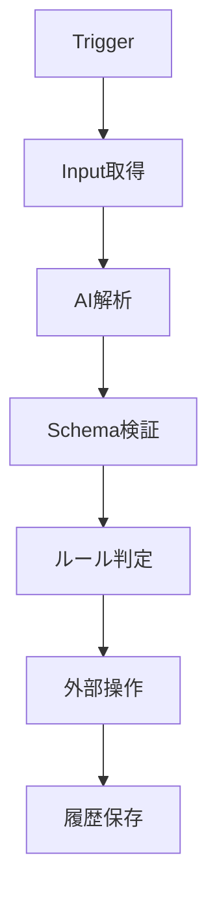

# <エージェント名> 仕様書

## 1. 文書情報

| 項目 | 内容 |
|---|---|
| Agent ID | `<agent-id>` |
| ステータス | Draft |
| バージョン | 0.1.0 |
| 最終更新日 | YYYY-MM-DD |
| オーナー |  |

## 2. 目的

このエージェントが解決する課題と、利用者にもたらす価値を記載します。

## 3. 対象範囲

### 対象

- 

### 対象外

- 

## 4. ユーザーストーリー

```text
利用者として、
<状況> のとき、
<操作・自動処理> を行いたい。
なぜなら <得られる価値> だからである。
```

## 5. 入力と出力

### 入力

| 入力 | 形式 | 必須 | 説明 |
|---|---|---:|---|
|  |  |  |  |

### 出力

| 出力 | 形式 | 説明 |
|---|---|---|
|  |  |  |

## 6. トリガー

- 手動
- 定期実行
- Webhook
- 外部イベント

利用するものだけを残します。

## 7. 利用ツール・外部サービス

| サービス | 用途 | 読み取り | 書き込み |
|---|---|---:|---:|
|  |  |  |  |

## 8. 全体フロー



## 9. AIの責務

### AIに任せる処理

- 

### AIに任せない処理

- 外部サービスの認証
- 権限判定
- 冪等性判定
- 高リスク操作の最終承認

## 10. 構造化出力

LLMが返すJSON SchemaまたはZod Schemaを記載します。

```ts
export const OutputSchema = z.object({});
```

## 11. ドメインルール

- AI出力を無条件で実行しない。
- 外部書き込み前に入力、権限、状態、信頼度を検証する。
- 曖昧な場合は `NEEDS_REVIEW` とする。

エージェント固有ルールを追記します。

## 12. 状態遷移

```text
QUEUED
  ↓
RUNNING
  ├── NEEDS_REVIEW
  ├── RETRY_WAITING
  ├── FAILED
  └── COMPLETED
```

## 13. データモデル

共通テーブルと固有テーブルを記載します。

## 14. API・イベント

### API

| Method | Path | 用途 |
|---|---|---|
|  |  |  |

### イベント

| イベント | 発行元 | 利用目的 |
|---|---|---|
|  |  |  |

## 15. セキュリティ

- OAuthスコープ
- 秘密情報の保存方法
- 個人情報の保存範囲
- ログのマスキング
- Prompt Injection対策
- 権限取り消し時の動作

## 16. エラー・リトライ

| エラー | リトライ | 動作 |
|---|---:|---|
| 一時的な外部APIエラー | Yes | 指数バックオフ |
| 認証失敗 | No | 連携更新を要求 |
| 構造化出力不正 | Yes | 1回再生成後、要確認 |

## 17. 監視

- 実行数
- 成功率
- 要確認率
- 外部APIエラー率
- AI解析時間
- エージェント単位の推定コスト

## 18. 受け入れ条件

- [ ] 正常系
- [ ] 異常系
- [ ] 重複実行
- [ ] 権限不足
- [ ] 曖昧な入力
- [ ] 外部API停止

## 19. テスト方針

- Unit Test
- Integration Test
- Contract Test
- E2E Test
- AI評価データセット
- 回帰評価

## 20. 段階的リリース

1. 手動実行
2. 下書き・候補作成のみ
3. 低リスク操作の自動化
4. 本番トリガー接続
5. 監視・評価に基づく改善
